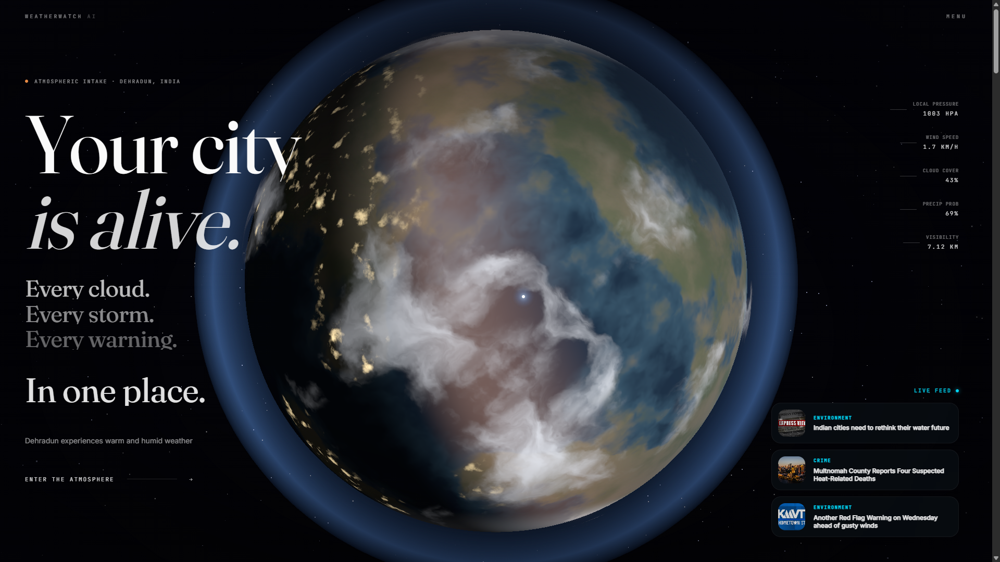
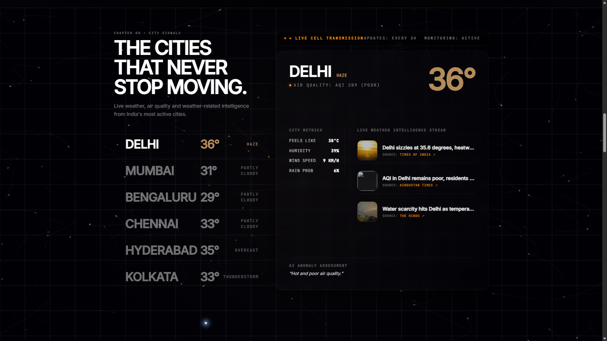
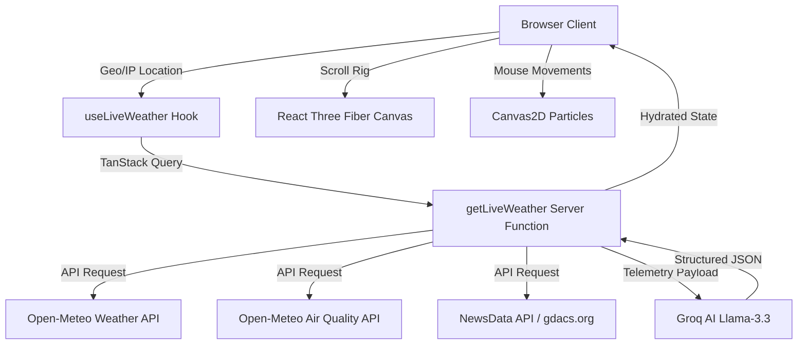

# WeatherWatch AI

> **Real-Time Planetary Weather Intelligence Platform**

WeatherWatch AI is an immersive, cinematic, real-time planetary weather monitoring and predictive forecasting dashboard. It combines custom WebGL 3D shaders, physics-based canvas particle fields, and AI-powered narration to transform standard meteorological metrics into actionable, high-fidelity environmental intelligence.

**Live Website:** [weatherwatch-ai.vercel.app](https://weatherwatch-ai.vercel.app/)

**Video Showcase:** [Showcase Demo Video](https://kdvhmvy9l6gqbosc.public.blob.vercel-storage.com/weatherwatch.mp4)

---

## Screenshots

### 1. Cinematic Orbit & Global Telemetry


### 2. City Signals Dashboard & Climate Feeds


---

## Features

- **Dynamic Planetary Stage:** A 3D WebGL Earth utilizing custom vertex/fragment shaders for real-time land mass rendering, ocean depth blending, day/night city lights glow, sunset/sunrise terminators, and dynamic fresnel rim scattering.
- **Micro-climate Particles:** Cursor-interactive HTML5 Canvas 2D simulation representing fine PM2.5 particles, dust, pollen, and humidity settling across a dense, scrollable atmosphere.
- **Signal Lattice Network:** Volumetric neural paths showing raw environmental signals propagating and snapping onto infrastructure/safety rails.
- **Predictive Divergence Branches:** Interactive forecasting model mapping storm trajectory probability distributions and confidence percentages.
- **AI Narrative Engine:** Real-time query matching powered by Llama-3.3-70b-versatile via Groq, translating coordinate telemetry into concise, actionable travel, health, and risk-management instructions.
- **GDACS & Open-Meteo Integration:** Global disaster mapping (cyclones, wildfires, earthquakes, floods, extreme heat) and real-time city weather updates.

---

## Tech Stack

- **Core Framework:** [TanStack Start](https://tanstack.com/router/v1/docs/start/overview) (full-stack React with file-based routing and SSR)
- **State & Queries:** TanStack React Query (`@tanstack/react-query`)
- **Styling:** Tailwind CSS v4 configured with HSL/OKLCH color variables
- **3D Engine:** Three.js via React Three Fiber (`@react-three/fiber` & `@react-three/drei`)
- **Graphics & Composition:** Canvas2D rendering contexts & Post-processing Bloom/Vignette filters
- **Animations:** Framer Motion, GSAP, and custom CSS keyframes
- **LLM Integration:** Groq SDK (Llama-3.3-70b-versatile)
- **Package Manager:** Bun / npm

---

## Folder Structure

```text
weatherwatch-ai/
├── docs/
│   └── screenshots/          # Repository assets and screenshots (ss1, ss2)
├── public/
│   ├── favicon.svg           # Main browser icon
│   └── robots.txt            # Search crawler directives
├── src/
│   ├── components/
│   │   ├── ui/               # Modular Shadcn UI core components
│   │   ├── sections/         # Visual narrative chapters and interactive canvases
│   │   │   ├── atmosphere/   # 3D Earth, Cloud layers, and Camera rig shaders
│   │   │   ├── city-signals/ # Localized telemetry grid for Indian metros
│   │   │   └── scene03 - 08/ # Interactive scroll scenes and AI panels
│   │   └── shared/           # Cross-cutting application utilities
│   │       ├── cursor/       # Interactive custom cursor
│   │       ├── loader/       # Pre-rendered boot timeline
│   │       └── nav/          # Atmospheric overlays & menu systems
│   ├── hooks/                # Custom hooks (geolocation, live weather data)
│   ├── lib/                  # Server functions, data APIs, error capture
│   ├── routes/               # File-system router segments (__root, index)
│   ├── start.ts              # Client bootstrapping and middlewares
│   ├── server.ts             # Server runtime and SSR configurations
│   ├── router.tsx            # Router instantiation
│   └── styles.css            # Tailwind CSS vlayer configs and theme variables
├── .env.example              # Placeholder config variables
├── .gitignore                # System and lock files mapping
├── bun.lock                  # Lockfile for Bun package manager
├── package.json              # App dependencies & run scripts
├── tsconfig.json             # TypeScript compiler rules
└── vite.config.ts            # Vite build setup with Nitro presets
```

---

## Environment Variables

The application requires a Groq API key to activate the AI Narration and localized weather reporting. Create a `.env` file in the project root:

```env
# powers the AI weather narration inside src/lib/weather.functions.ts
GROQ_API_KEY=your_groq_api_key_here
```

---

## Installation

### Prerequisites
Make sure you have Node.js (v18+) or Bun installed.

### 1. Clone the repository
```bash
git clone https://github.com/StrikerFr/PinnacleLabs-Internship.git
cd PinnacleLabs-Internship
```

### 2. Install dependencies
```bash
npm install
# or if using Bun
bun install
```

### 3. Setup environment configuration
```bash
cp .env.example .env.local
```
*(Open `.env.local` and add your `GROQ_API_KEY`)*

### 4. Launch the local dev server
```bash
npm run dev
# or if using Bun
bun dev
```

### 5. Build for production
```bash
npm run build
```

---

## Architecture & Data Flow



1. **Client Resolution:** The browser queries HTML5 geolocation coordinates. If denied, it falls back to IP geolocation.
2. **Server Fetch:** TanStack Start queries the server function (`getLiveWeather`) which concurrently scrapes weather stats, air index metrics, global disasters, and climate news feeds.
3. **AI Synthesizer:** Telemetry metrics are piped to the Groq API (Llama-3.3-70b-versatile) to generate natural language instructions.
4. **Cinematic Render:** The client orchestrates the 3D orbit camera and local HTML5 Canvas overlays synchronously as the user scrolls down the landing page.

---

## Future Improvements

- **Volumetric Fog Shaders:** Implement true ray-marched fog inside the Three.js viewport for a more volumetric atmosphere.
- **Cross-Continental Telemetry:** Add visual indicators overlaying coordinates directly onto the 3D globe to dynamically highlight weather anomalies.
- **Search Autocomplete:** Integrate Google Places / Open-Meteo geocoding search to allow users to inspect any coordinate on the planet.

---

## License

This project is licensed under the MIT License - see the [LICENSE](LICENSE) file for details.
