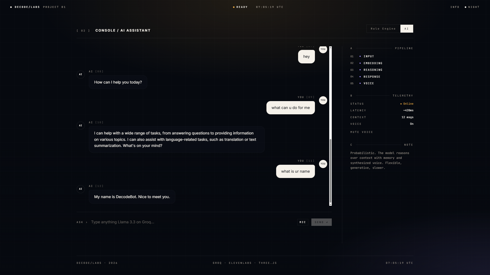

# TaskPilot AI 🚀

> **Turn any goal into a daily action plan.** An intelligent, AI-driven daily planner and career coach designed to help student builders stay on track and construct structured paths to their goals.

<div align="center">

[](https://ai-taskpilot.vercel.app)
[](https://kdvhmvy9l6gqbosc.public.blob.vercel-storage.com/pinnacle1st.mp4)

</div>

---

## 🌟 Key Features

- **3D Interactive Monolith Landing Page**: Immersive landing page featuring interactive floating monoliths, drifting auroras, and mouse-tracked particle systems powered by **Three.js** and **Framer Motion**.
- **Apple Watch-Style Activity Rings**: Track daily habits in real time with circular visual metrics mapping **Focus**, **Movement**, and **Reflection** time blocks.
- **Intelligent AI Mentor (Llama 3)**: An embedded career mentor powered by the **Groq SDK** supporting specialized coaching modes:
  - **Career Strategist** — Design high-level professional pathways.
  - **Productivity Coach** — Optimise time blocking and daily outputs.
  - **Learning Coach** — Architect custom studying curves.
  - **Interview Coach** — Interactive mock interviews and prep.
- **AI Roadmap Blueprint Generator**: Input any ambition (e.g., "Crack Google Interview", "Learn React in 30 days") to generate a multi-phase learning timeline complete with study targets, resources, projects, and milestone outcomes.
- **Apple Health-inspired Schedule List**: Fully customizable, drag-free timeline blocking to map out your day. Contains inline task checklists, Pomodoro timer integrations, and confetti completion animations.
- **Identity Dossier & settings**: Complete settings panel to sync personal credentials, institutional year, GPA, target companies, and current skills.

---

## 🎥 Video Showcase

Watch TaskPilot AI in action:

<div align="center">
  <video src="https://kdvhmvy9l6gqbosc.public.blob.vercel-storage.com/pinnacle1st.mp4" width="100%" controls poster="public/screenshots/obsidian_mode.png"></video>
  <br />
  <sub>💡 <i>Can't see the player? Watch it directly <a href="https://kdvhmvy9l6gqbosc.public.blob.vercel-storage.com/pinnacle1st.mp4">here</a>.</i></sub>
</div>

---

## 📸 Screenshots

### 🌌 Obsidian Mode (Landing Page)

An immersive 3D landing page with drifting auroras, customizable monolith layouts, and particles powered by Three.js & Framer Motion.

<p align="center">
  
</p>

### 🌅 Ivory Mode (Onboarding & Mentorship Dashboard)

Sleek, cream-based dashboard layouts built for focus, time blocking, habit loops, and interactive career coaching.

<p align="center">
  
</p>

---

## 💻 Tech Stack

- **Core Framework**: React 19, TypeScript
- **SSR Bundler & Routing**: **TanStack Start** (Vinxi-driven compiler with file-based routing)
- **Styling**: **Tailwind CSS v4** + custom OKLCH/HSL color tokens
- **Inference Pipeline**: Groq SDK (`llama-3.3-70b-versatile` & `llama-3.1-8b-instant`)
- **3D / Animations**: Three.js, Framer Motion, Lucide Icons
- **Local Storage**: Synchronous JSON File Database System (`local-db.json`)
- **Primitives**: Radix UI (accessible state components)

---

## 🛠️ Getting Started

### Prerequisites

- Node.js (v18 or higher)
- NPM or Bun package manager
- A Groq API Key (Obtain one for free at [Groq Console](https://console.groq.com/))

### Installation

1. **Clone the Repository**

   ```bash
   git clone https://github.com/your-username/taskpilot-ai.git
   cd taskpilot-ai
   ```

2. **Install Dependencies**

   ```bash
   npm install
   ```

3. **Configure Environment Variables**
   Copy `.env.example` to `.env` and fill in your Groq API Key:

   ```bash
   cp .env.example .env
   ```

   Edit `.env`:

   ```env
   GROQ_API_KEY=gsk_your_actual_key_here
   ```

4. **Seed the Database**
   Populate `local-db.json` with initial mock profiles, schedule blocks, and notes:

   ```bash
   node seed.cjs
   ```

5. **Start Dev Server**
   ```bash
   npm run dev
   ```
   Open your browser to `http://localhost:3000` to start piloting your career!

---

## 📂 Project Structure

```
taskpilot-ai/
├── public/
│   └── favicon.svg           # Project icon
├── src/
│   ├── components/           # Modular component architecture
│   │   ├── app/              # Core layouts (AppShell, Atmosphere, AuroraBg)
│   │   ├── dashboard/        # Dashboard panels (EmbeddedCoach, PhaseCard, ProgressRing)
│   │   ├── sections/         # Immersive landing page sections (Hero, Roadmap, Intelligence, Final)
│   │   └── ui/               # Radix/Shadcn primitives (Buttons, Dialogs, Inputs, etc.)
│   ├── hooks/                # Custom utility hooks
│   ├── lib/                  # Server-side functions & configs
│   │   ├── ai.functions.ts   # Groq-powered AI server functions
│   │   ├── data.functions.ts # Profile & task server functions
│   │   ├── groq.server.ts    # Groq Client config and types
│   │   └── local-db.server.ts # Offline JSON database reader/writer
│   ├── routes/               # TanStack Start File-based routing
│   │   ├── _authenticated/   # Protected user views (app, onboarding, settings)
│   │   └── index.tsx         # Landing page route
│   ├── types/                # Strict TypeScript model definitions
│   │   └── index.ts          # Core entity interfaces
│   ├── styles.css            # Tailwind CSS v4 design system
│   ├── router.tsx            # TanStack Router configuration
│   └── start.ts              # TanStack Start initialization
├── .env.example              # Environment variables template
├── local-db.json             # Mock database file
├── seed.cjs                  # DB Seeder script
├── tsconfig.json             # TypeScript compiler settings
└── vite.config.ts            # Vite bundler parameters
```

---

## 📄 License

This project is licensed under the MIT License - see the [LICENSE](LICENSE) file for details.
