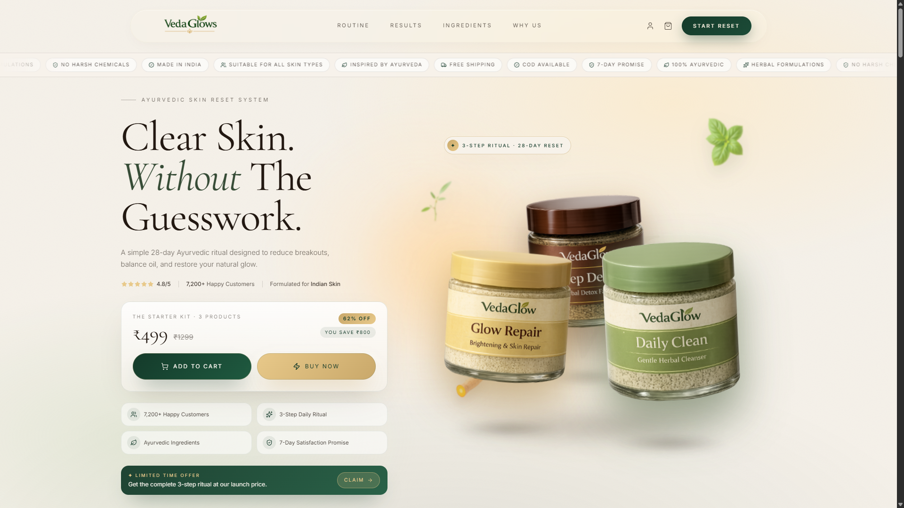
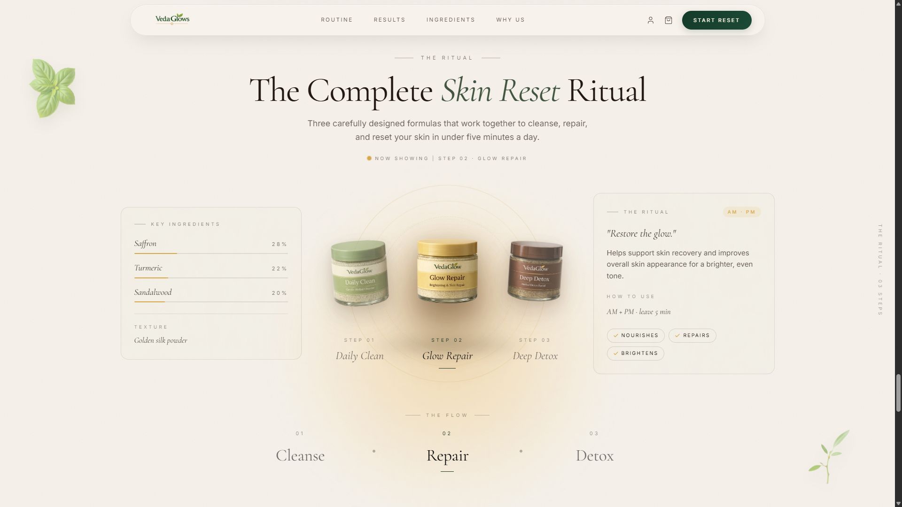

# VedaGlows 🌿

> **A simple 28-day Ayurvedic ritual to reduce breakouts, balance oil and restore your natural glow. Made for Indian skin.**

[](https://eccomerce-demo.vercel.app)
[](https://kdvhmvy9l6gqbosc.public.blob.vercel-storage.com/pinnacle2.mp4)
[](#)
[](#)
[](#)
[](#)

---

## 📖 Overview

**VedaGlows** is a premium, high-performance e-commerce web application specializing in modernized Ayurvedic skincare. The project is designed with a premium, organic aesthetic utilizing HSL/OKLCH color themes, smooth micro-animations, and responsive performance optimizations.

To facilitate instant testing and zero-setup deployment for the **Pinnacle Labs Internship Program**, the repository features a fully functional client-side mockup layer that operates on a local storage-backed Supabase instance, allowing user accounts, orders, profile updates, and coupon management to run entirely client-side without any third-party credentials.

---

## ✨ Features

- 🛍️ **Premium Shopping Flow:** A beautiful, responsive interface featuring floating action items, interactive product detail selectors, and persistent drawers.
- 📐 **Dynamic Tiered Pricing:** Automated shopping cart logic that clusters items into bulk packages dynamically to optimize checkout prices (e.g., triples first, then remaining pairs, then single kits).
- 🎫 **Advanced Coupon System:** Local coupon validator featuring fixed/percentage discounts and special promotional codes (e.g. `ROHIT5` bundle adjustments).
- 💳 **Secure Checkout Form:** Fully functional address validation, online (Razorpay mock) and COD payment options, complete with automated city/state zip code lookup.
- 👤 **Customer Dashboard:** Authenticated route layouts `/account` and `/order/$id` to review profile preferences, track orders, check loyalty tiers, and view transaction receipts.
- 🚀 **Performance Optimizations:** Deferral of below-the-fold component parsing using CSS `content-visibility: auto`, alongside mobile-specific overrides that drop heavy blurs and battery-draining loops on lower-end devices.

---

## 🛠️ Tech Stack

- **Frontend Core:** React 19, TypeScript
- **Routing & SSR:** TanStack Start, TanStack Router (file-based routing)
- **Data Fetching:** TanStack React Query v5
- **Styling:** Tailwind CSS v4.0 (Vite integration), Vanilla CSS animations
- **State Management:** Zustand, LocalStorage Persistence
- **UI Components:** Radix UI primitives, Lucide Icons, Sonner toasts
- **Database & Auth Layer:** Supabase JS client (configured with an interactive LocalStorage-based Mock Client)
- **Deployment:** Vercel / Nitro server runtime

---

## 📸 Screenshots

### 1. Land Page & Product Showcase



### 2. Interactive Shopping Cart


### 3. Secure Checkout Screen



---

## 🏛️ Architecture & Folder Structure

The project has been organized following industry standards for modularity and scalability:

```
Project2 - Eccomerce/
├── .github/                 # GitHub workflows for CI/CD pipeline
├── docs/                    # Documentation and static media assets
│   └── screenshots/         # Application feature screenshots
├── public/                  # Static assets served directly (Favicon, Robots.txt)
│   └── assets/              # High-resolution product images and graphics
├── src/                     # Core React & TanStack codebase
│   ├── components/          # Reusable UI elements
│   │   ├── sections/        # Section-specific components (Hero, Formula, Story, etc.)
│   │   ├── shared/          # Shared layout components (Navbar, Footer, CartDrawer, etc.)
│   │   └── ui/              # Radix UI wrapper primitives (Button, Card, Input, etc.)
│   ├── hooks/               # Custom application React hooks (useAuth, useIsAdmin)
│   ├── integrations/        # Backend connections
│   │   └── supabase/        # Supabase server/client connections and mock database stores
│   ├── lib/                 # Shared utilities, store state, formatters, and server functions
│   │   ├── api/             # API routes and fetch configurations
│   │   └── ...              # Zustand stores (cart-store.ts) and payment/checkout helpers
│   ├── routes/              # TanStack Start file-based routing controllers
│   │   └── _authenticated/  # Layout guards for secure user/dashboard account pages
│   ├── routeTree.gen.ts     # Auto-generated TanStack router configuration
│   ├── router.tsx           # QueryClient context and router wrapper
│   ├── server.ts            # Custom server entry script (catastrophic SSR error handlers)
│   ├── start.ts             # Client entry script
│   └── styles.css           # Global design system variables (OKLCH color configurations)
├── supabase/                # Supabase database configurations
│   └── migrations/          # SQL database schemas for tables, roles, and profiles
├── .env.example             # Template file for environment variables
├── eslint.config.js         # ESLint code linter rules
├── package.json             # NPM package scripts and dependencies
├── tsconfig.json            # TypeScript compiler configuration
└── vite.config.ts           # Vite bundler, Tailwind, and TanStack Start plugins
```

---

## 🚀 Installation & Local Development

### Prerequisites

Make sure you have [Node.js](https://nodejs.org/) installed (v18+ recommended).

### 1. Clone & Navigate

```bash
git clone https://github.com/PLACEHOLDER_GITHUB_USER/Project2-Eccomerce.git
cd Project2-Eccomerce
```

### 2. Install Dependencies

```bash
npm install
```

### 3. Setup Environment Variables

Copy the template configuration file:

```bash
cp .env.example .env
```

_(By default, the application runs entirely client-side using localized mock configurations. No actual database keys are required to build or execute locally.)_

### 4. Run Development Server

```bash
npm run dev
```

Open [http://localhost:3000](http://localhost:3000) to view the application.

### 5. Build for Production

```bash
npm run build
```

---

## 🔑 Environment Variables

The project includes an [.env.example](.env.example) configuration template containing parameters for standard production deployments:

- `NODE_ENV`: Application running mode (e.g. `development`, `production`).
- `NITRO_PRESET`: Nitro compilation preset (e.g. `vercel`).
- `VITE_SUPABASE_URL` / `VITE_SUPABASE_ANON_KEY`: Supabase connection configuration.
- `VITE_RAZORPAY_KEY_ID`: Client public key for payment processing.

---

## 🛡️ License

This project is open-source software licensed under the [MIT License](LICENSE).
